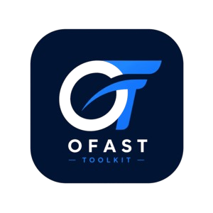
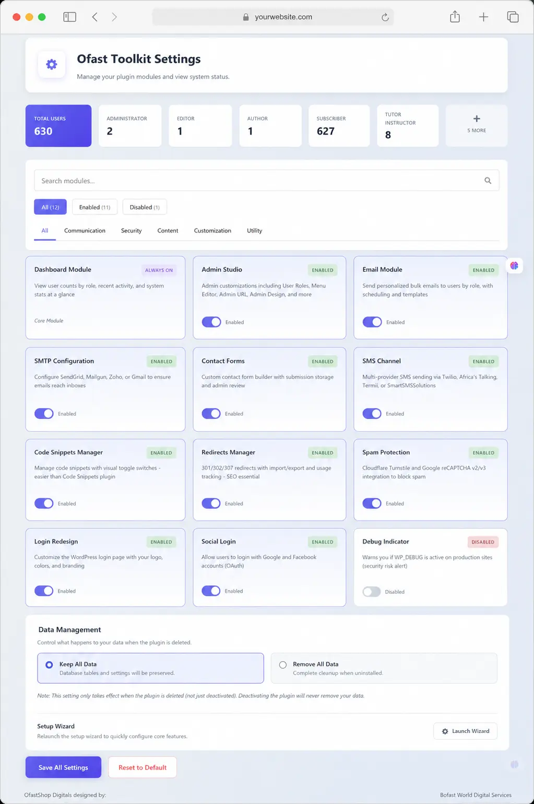

PageSpeed Insights logo
PageSpeed Insights
Report from May 24, 2026, 11:51:50 PM
https://toolkit.ofastshop.com/
Enter a valid URL

smartphone
Mobile

computer
Desktop

Discover what your real users are experiencing
No Data

Diagnose performance issues
77
Performance
97
Accessibility
100
Best Practices
92
SEO
77
FCP
+5
LCP
+8
TBT
+30
CLS
+25
SI
+9
Performance
Values are estimated and may vary. The performance score is calculated directly from these metrics.See calculator.
0–49
50–89
90–100
Final Screenshot

Metrics
Expand view
First Contentful Paint
2.9 s
Largest Contentful Paint
4.8 s
Total Blocking Time
0 ms
Cumulative Layout Shift
0.004
Speed Index
3.5 s
Captured at May 24, 2026, 11:51 PM GMT+1
Emulated Moto G Power with Lighthouse 13.0.1
Single page session
Initial page load
Slow 4G throttling
Using HeadlessChromium 146.0.7680.177 with lr
View Treemap
Screenshot
Screenshot
Screenshot
Screenshot
Screenshot
Screenshot
Screenshot
Screenshot
Show audits relevant to:

All

FCP

LCP

TBT

CLS
Insights
Improve image delivery Est savings of 91 KiB
Reducing the download time of images can improve the perceived load time of the page and LCP. Learn more about optimizing image sizeLCPFCPUnscored
URL
Resource Size
Est Savings
ofastshop.com 1st party
107.3 KiB	90.6 KiB
Ofast Toolkit Logo

…img/ofast-tookit-logo__2_-removebg-preview.png(toolkit.ofastshop.com)
48.2 KiB
47.8 KiB
Using a modern image format (WebP, AVIF) or increasing the image compression could improve this image's download size.
33.5 KiB
This image file is larger than it needs to be (300x300) for its displayed dimensions (49x49). Use responsive images to reduce the image download size.
46.9 KiB
Ofast Toolkit Dashboard Interface

…img/hero_image.webp(toolkit.ofastshop.com)
59.1 KiB
42.8 KiB
This image file is larger than it needs to be (1023x1537) for its displayed dimensions (537x807). Use responsive images to reduce the image download size.
42.8 KiB
Use efficient cache lifetimes Est savings of 2,182 KiB
A long cache lifetime can speed up repeat visits to your page. Learn more about caching.LCPFCPUnscored
Request
Cache TTL
Transfer Size
ofastshop.com 1st party
3,302 KiB
/assets/video_1.mp4(toolkit.ofastshop.com)
4h
3,184 KiB
…img/hero_image.webp(toolkit.ofastshop.com)
7d
60 KiB
…img/ofast-tookit-logo__2_-removebg-preview.png(toolkit.ofastshop.com)
7d
49 KiB
…css/main.css?v=3.7(toolkit.ofastshop.com)
7d
8 KiB
…cloudflare-static/email-decode.min.js(toolkit.ofastshop.com)
1d 23h 59m 51s
1 KiB
Cloudflare utility 
12 KiB
/beacon.min.js/v833ccba…(static.cloudflareinsights.com)
1d
12 KiB
Font display Est savings of 30 ms
Consider setting font-display to swap or optional to ensure text is consistently visible. swap can be further optimized to mitigate layout shifts with font metric overrides.FCPUnscored
URL
Est Savings
Cloudflare CDN cdn 
…webfonts/fa-brands-400.woff2(cdnjs.cloudflare.com)
30 ms
…webfonts/fa-solid-900.woff2(cdnjs.cloudflare.com)
30 ms
…webfonts/fa-regular-400.woff2(cdnjs.cloudflare.com)
20 ms
Forced reflow
A forced reflow occurs when JavaScript queries geometric properties (such as offsetWidth) after styles have been invalidated by a change to the DOM state. This can result in poor performance. Learn more about forced reflows and possible mitigations.Unscored
Source
Total reflow time
[unattributed]
50 ms
https://toolkit.ofastshop.com:1226:52
63 ms
https://toolkit.ofastshop.com:1227:53
1 ms
Network dependency tree
Avoid chaining critical requests by reducing the length of chains, reducing the download size of resources, or deferring the download of unnecessary resources to improve page load.LCPUnscored
Maximum critical path latency: 1,352 ms
Initial Navigation
https://toolkit.ofastshop.com - 765 ms, 11.75 KiB
…cloudflare-static/email-decode.min.js(toolkit.ofastshop.com) - 1,352 ms, 1.25 KiB
…css/main.css?v=3.7(toolkit.ofastshop.com) - 814 ms, 7.73 KiB
Preconnected origins
preconnect hints help the browser establish a connection earlier in the page load, saving time when the first request for that origin is made. The following are the origins that the page preconnected to.
Origin
Source
https://fonts.googleapis.com/
head > link
<link rel="preconnect" href="https://fonts.googleapis.com">
https://fonts.gstatic.com/
head > link
<link rel="preconnect" href="https://fonts.gstatic.com" crossorigin="">
Preconnect candidates
Add preconnect hints to your most important origins, but try to use no more than 4.
No additional origins are good candidates for preconnecting
Render blocking requests
Requests are blocking the page's initial render, which may delay LCP. Deferring or inlining can move these network requests out of the critical path.LCPFCPUnscored
URL
Transfer Size
Duration
ofastshop.com 1st party
7.7 KiB	160 ms
…css/main.css?v=3.7(toolkit.ofastshop.com)
7.7 KiB
160 ms
Layout shift culprits
Optimize DOM size
LCP breakdown
3rd parties
These insights are also available in the Chrome DevTools Performance Panel - record a trace to view more detailed information.
Diagnostics
Reduce unused CSS Est savings of 18 KiB
Reduce unused rules from stylesheets and defer CSS not used for above-the-fold content to decrease bytes consumed by network activity. Learn how to reduce unused CSS.LCPFCPUnscored
URL
Transfer Size
Est Savings
Cloudflare CDN cdn 
18.4 KiB	18.0 KiB
…css/all.min.css(cdnjs.cloudflare.com)
18.4 KiB
18.0 KiB
Image elements do not have explicit width and height
Set an explicit width and height on image elements to reduce layout shifts and improve CLS. Learn how to set image dimensionsCLSUnscored
URL
ofastshop.com 1st party
Ofast Toolkit Dashboard Interface

…img/hero_image.webp(toolkit.ofastshop.com)
Ofast Toolkit Logo

…img/ofast-tookit-logo__2_-removebg-preview.png(toolkit.ofastshop.com)
Ofast Toolkit Logo

…img/ofast-tookit-logo__2_-removebg-preview.png(toolkit.ofastshop.com)
Unattributable
Modular Dashboard UI

Security Shield UI

Performance Graph UI

Minify CSS Est savings of 2 KiB
Minifying CSS files can reduce network payload sizes. Learn how to minify CSS.LCPFCPUnscored
URL
Transfer Size
Est Savings
ofastshop.com 1st party
7.7 KiB	2.0 KiB
…css/main.css?v=3.7(toolkit.ofastshop.com)
7.7 KiB
2.0 KiB
Avoid enormous network payloads Total size was 3,772 KiB
Large network payloads cost users real money and are highly correlated with long load times. Learn how to reduce payload sizes.Unscored
URL
Transfer Size
ofastshop.com 1st party
3,293.1 KiB
/assets/video_1.mp4(toolkit.ofastshop.com)
3,184.3 KiB
…img/hero_image.webp(toolkit.ofastshop.com)
59.8 KiB
…img/ofast-tookit-logo__2_-removebg-preview.png(toolkit.ofastshop.com)
49.0 KiB
Cloudflare CDN cdn 
314.9 KiB
…webfonts/fa-solid-900.woff2(cdnjs.cloudflare.com)
153.7 KiB
…webfonts/fa-brands-400.woff2(cdnjs.cloudflare.com)
116.0 KiB
…webfonts/fa-regular-400.woff2(cdnjs.cloudflare.com)
25.7 KiB
…css/all.min.css(cdnjs.cloudflare.com)
19.5 KiB
Google Fonts cdn 
107.7 KiB
…v17/rP2Yp2ywx….woff2(fonts.gstatic.com)
36.9 KiB
…v27/uU9NCBsR6….woff2(fonts.gstatic.com)
36.3 KiB
…v24/8vIH7w4qz….woff2(fonts.gstatic.com)
34.5 KiB
Minimize main-thread work 2.3 s
Consider reducing the time spent parsing, compiling and executing JS. You may find delivering smaller JS payloads helps with this. Learn how to minimize main-thread workTBTUnscored
Category
Time Spent
Style & Layout
988 ms
Other
828 ms
Script Evaluation
256 ms
Rendering
201 ms
Parse HTML & CSS
30 ms
Script Parsing & Compilation
7 ms
Avoid non-composited animations 2 animated elements found
Avoid long main-thread tasks 4 long tasks found
More information about the performance of your application. These numbers don't directly affect the Performance score.
Passed audits (10)
Show
97
Accessibility
These checks highlight opportunities to improve the accessibility of your web app. Automatic detection can only detect a subset of issues and does not guarantee the accessibility of your web app, so manual testing is also encouraged.
Navigation
Heading elements are not in a sequentially-descending order
Properly ordered headings that do not skip levels convey the semantic structure of the page, making it easier to navigate and understand when using assistive technologies. Learn more about heading order.
Failing Elements
Plugin conflicts everywhere
<h4>
Excellence
<h4>
PLUGIN
<h4>
These are opportunities to improve keyboard navigation in your application.
Audio and video
<video> elements contain a <track> element with [kind="captions"]
These are opportunities to provide alternative content for audio and video. This may improve the experience for users with hearing or vision impairments.
Additional items to manually check (10)
Show
These items address areas which an automated testing tool cannot cover. Learn more in our guide on conducting an accessibility review.
Passed audits (13)
Show
Not applicable (45)
Show
100
Best Practices
Trust and Safety
Ensure CSP is effective against XSS attacks
Use a strong HSTS policy
Ensure proper origin isolation with COOP
Mitigate clickjacking with XFO or CSP
Mitigate DOM-based XSS with Trusted Types
Passed audits (13)
Show
Not applicable (2)
Show
92
SEO
These checks ensure that your page is following basic search engine optimization advice. There are many additional factors Lighthouse does not score here that may affect your search ranking, including performance on Core Web Vitals. Learn more about Google Search Essentials.
Crawling and Indexing
robots.txt is not valid 1 error found
To appear in search results, crawlers need access to your app.
Additional items to manually check (1)
Show
Run these additional validators on your site to check additional SEO best practices.
Passed audits (8)
Show
Not applicable (1)
Show
More on PageSpeed Insights
What's new
Documentation
Learn about Web Performance
Ask questions on Stack Overflow
Mailing list
Related Content
Updates
Web Fundamentals
Case Studies
Podcasts
Connect
Twitter
Youtube
Google Developers Logo
Chrome
Firebase
All products
Terms and Privacy Policy
For details, see the Google Developers Site Policies.
